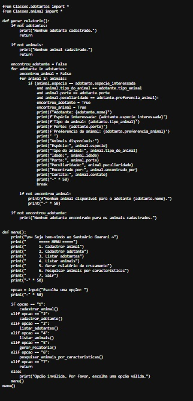
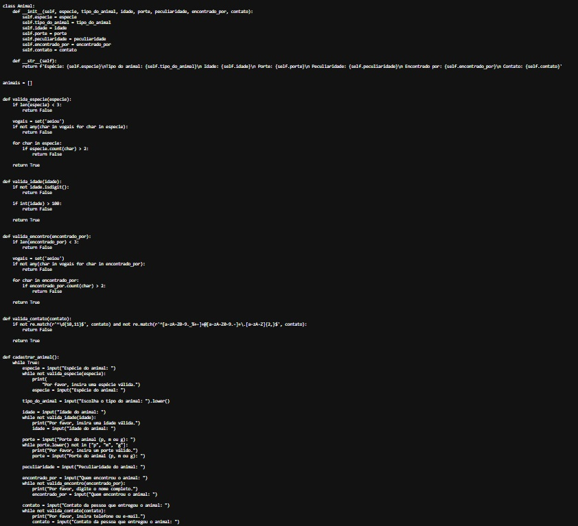
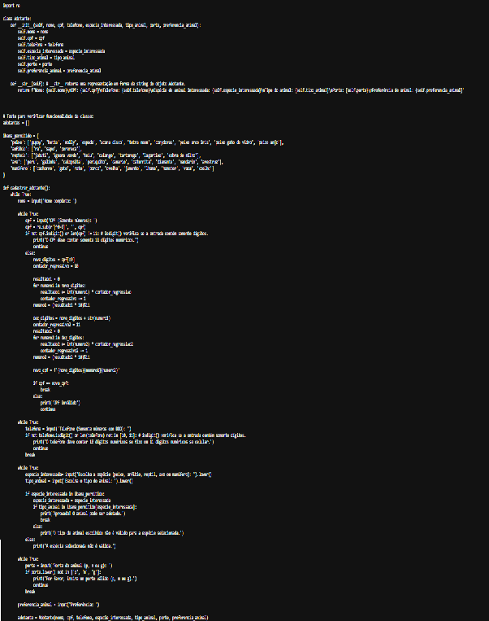

<h1 align="center"> Estrutura de Dados </h1>

<h5>Curso: Engenharia de Software 
Disciplica: Estrutura de Dados 
Professor: <a href="https://github.com/marciogarridoLaCop">Marcio Garrido</a> 
Período: 3° Período 
Aluno: Daniel Monteiro e Gabriel Martins </h5>

<h3 align="center">ENUNCIADO</h3>

 A Universidade de Vassouras do Campus 1 foi convidada pela prefeitura de Maricá para promover uma solução tecnológica em um dos problemas sociais da cidade, o abandono de animais. Mesmo considerado crime (O abandono de animais é crime, previsto na Lei de Crimes Ambientais - Lei Federal n° 9.605 de 1998), e notório que o índice de abandono vem crescendo a cada ano.

 Os alunos do curso de Engenharia de Software foram convocados para a reunião com a secretaria da cidade para entender a demanda solicitada e alguns pontos foram levantados.

 A prefeitura precisa de um sistema que possa cadastrar todos os animais por tipo (canino, felino, etc.) e para tanto, é uma premissa que seja possível inserir novos tipos dinamicamente. Precisa ainda, que sejam classificados por idade aproximada, cor, porte e se possui alguma particularidade. No mesmo sistema, deverá ter também um cadastro de pessoas interessadas na adoção, contendo os dados principais de contato e qual espécie teria o interesse de adotar. Ao escolher a espécie, deve também informar se possui alguma preferência do animal. Por fim, no final do mês a prefeitura emitirá um relatório de cruzamento de espécies disponíveis x possíveis candidatos, ou quando um candidato a adoção ligar, que o atendente possa pesquisar se há algum animal com as características informadas.

 Os alunos anotaram atentamente a todas as observações, criaram o fluxograma do estudo de caso, e posteriormente o primeiro protótipo em Python, ainda que em modo texto, e sem requisitos gráficos. A ideia foi apenas validar a proposta do programa junto ao solicitante. Seguem abaixo os fluxogramas:

 

<h4 align="center">FLUXOGRAMA DO ESTUDO DE CASO - GERAL</h4>

 Exemplo de como deverá funcionar o sistema de forma geral desde a interação do mesmo com o usuário até a geração de relatorios mensais.

     

 Parte do código referente ao Fuxograma geral

     

 
<h4 align="center">FLUXOGRAMA DO ESTUDO DE CASO - ANIMAL</h4>

 É mostrado detalhadamente a forma que se propõe funcionar o cadastramento de animais no sistema, desde a inserção do mesmo até o armazenamento dos animais.

     

 Parte do código referente ao Fuxograma Animal

     

 
<h4 align="center">FLUXOGRAMA DO ESTUDO DE CASO - ADOTANTE</h4>

 É mostrado detalhadamente a forma que se propõe funcionar o cadastramento de adotantes no sistema, desde o cadastro do mesmo até o armazenamento dos dados. 

     

 Parte do código referente ao Fuxograma Adotante

     

